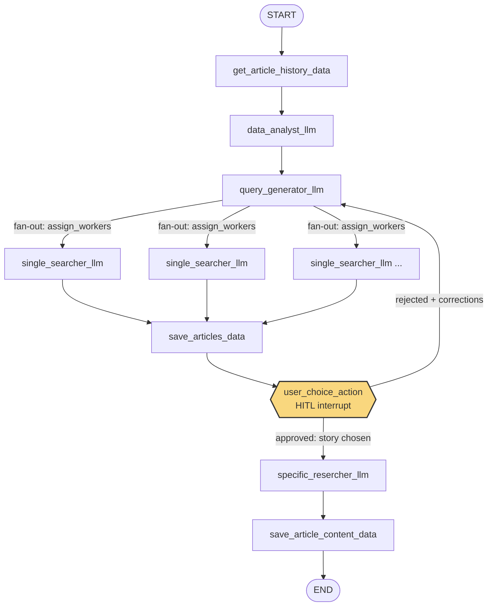

# Editorial Agent Graph

A multi-agent editorial pipeline built with **LangChain** and **LangGraph** that automates the research and drafting phase of publishing a tech news article — while keeping a human editor fully in control of the final decision.

> Built to support a small editorial team running an online tech magazine as a side responsibility alongside their main job. The goal was never to replace the editor's judgment, but to remove the most time-consuming part of the job: scanning the web for interesting, non-repetitive story ideas.

## Why this exists

Keeping a company tech magazine alive takes a recurring, time-consuming loop: check what's already been covered, scan the web for fresh and relevant news, pick an angle, and draft a first version of the article. Doing this well, on top of a full workload, doesn't scale.

This project turns that loop into a **stateful agent graph**: it remembers what's already been published, proposes balanced topics, researches multiple angles in parallel, and stops to ask the human for a decision before ever generating a full draft.

## Key features

- **History-aware topic selection** — reads previously published articles from a CSV archive and factors them into the state, so new topics fill coverage gaps instead of repeating them.
- **Hierarchical idea generation** — an LLM first defines macro-themes (broad tag-level direction), then breaks them down into 3–6 concrete search queries.
- **Parallel research workers** — one LLM worker per query runs concurrently (LangGraph `Send` / fan-out), each grounded on live Google Search, returning structured results (title, summary, source URL).
- **Human-in-the-loop checkpoint** — the graph pauses (`interrupt`) after research, writes all candidate stories to a plain text file, and waits for the editor to either:
  - pick a story by ID, or
  - reject all of them and provide free-text direction for a new round of research.
- **Feedback-driven retry loop** — if the editor rejects the results, the graph regenerates *only* the search queries (macro-themes stay fixed) using the editor's feedback, and avoids repeating semantically similar queries.
- **Grounded draft generation** — once a story is approved, a final LLM call writes a ~2000-character draft grounded on the selected source.

## Architecture



| Node | Role |
|---|---|
| `get_article_history_data` | Loads the published-articles archive (CSV) into state |
| `data_analyst_llm` | Picks 1–3 macro-theme tags for the next article, favoring under-covered topics |
| `query_generator_llm` | Breaks the macro-themes into 3–6 diverse search queries (or regenerates them from editor feedback) |
| `single_searcher_llm` | One instance per query, run in parallel; grounded search via the Google Search tool |
| `save_articles_data` | Aggregates all findings into a human-readable `notizie.txt` |
| `user_choice_action` | Interrupts the graph and waits for the editor's decision |
| `specific_resercher_llm` | Writes the final draft, grounded on the chosen source |
| `save_article_content_data` | Saves the draft to `content.txt` |

## Tech stack

- [LangGraph](https://langchain-ai.github.io/langgraph/) — stateful graph orchestration, fan-out workers, human-in-the-loop interrupts, checkpointing
- [LangChain](https://python.langchain.com/) — LLM abstraction layer
- [Google Gemini](https://ai.google.dev/) (`langchain-google-genai`) — structured output + native Google Search grounding
- Python 3.13, Pydantic / `TypedDict` for typed state

## Project structure

```
editorial-agent-graph/
├── graph/
│   ├── main.py                  # graph definition, CLI loop, interrupt handling
│   └── src/
│       ├── input_data/
│       │   └── articoli.csv     # sample article history (fictional data)
│       ├── nodes/
│       │   ├── data_nodes.py    # I/O nodes (read history, save outputs)
│       │   ├── llm_nodes.py     # LLM-backed nodes (analysis, query gen, search, drafting)
│       │   └── action_nodes.py  # routing / worker fan-out / HITL interrupt
│       ├── prompts/              # externalized prompt templates (.md)
│       ├── tools/                 # small utilities + logging decorators
│       ├── variables/
│       │   ├── models.py         # model names, paths, config
│       │   └── state_classes.py  # typed graph state
│       └── output/                # generated notizie.txt / content.txt (gitignored)
├── requirements.txt
├── pyproject.toml
└── .env.example
```

## Getting started

### Prerequisites
- Python 3.13+
- A [Google AI Studio](https://aistudio.google.com/app/apikey) API key (Gemini, with Google Search grounding)

### Installation

```bash
git clone https://github.com/bnodvd/editorial-agent-graph
cd editorial-agent-graph

# using uv (recommended, matches the included lockfile)
uv sync

# or with pip
pip install -r requirements.txt
```

### Configuration

```bash
cp .env.example .env
# then edit .env and add your GOOGLE_API_KEY
```

### Run

```bash
cd graph
python main.py
```

The graph will:
1. load the sample article history,
2. propose macro-themes and search queries,
3. run parallel research workers,
4. write candidate stories to `graph/src/output/notizie.txt`,
5. pause and ask you, via the terminal, to either enter a story ID or type `q` to give new direction.

If you approve a story, the graph writes the final draft to `graph/src/output/content.txt`.

## Sample data

`graph/src/input_data/articoli.csv` is a **fictional example dataset** with the same structure used in production (title, tags, whether it covered a "hot news" item, publication date). The real dataset — and the actual magazine — are not part of this repository.


## License

Distributed under the MIT License — see [LICENSE](LICENSE) for details.
